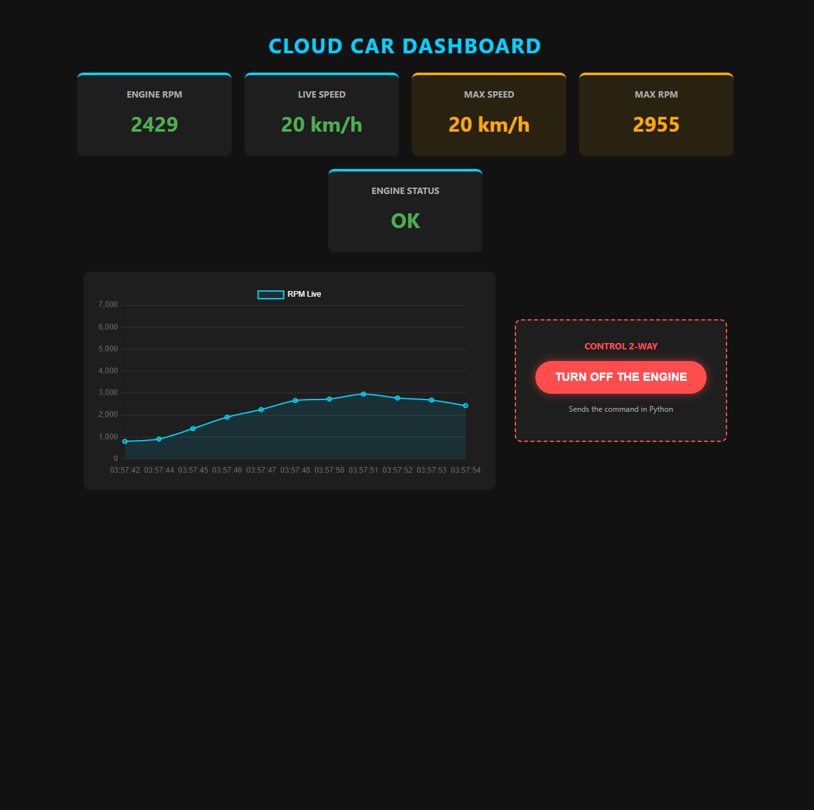
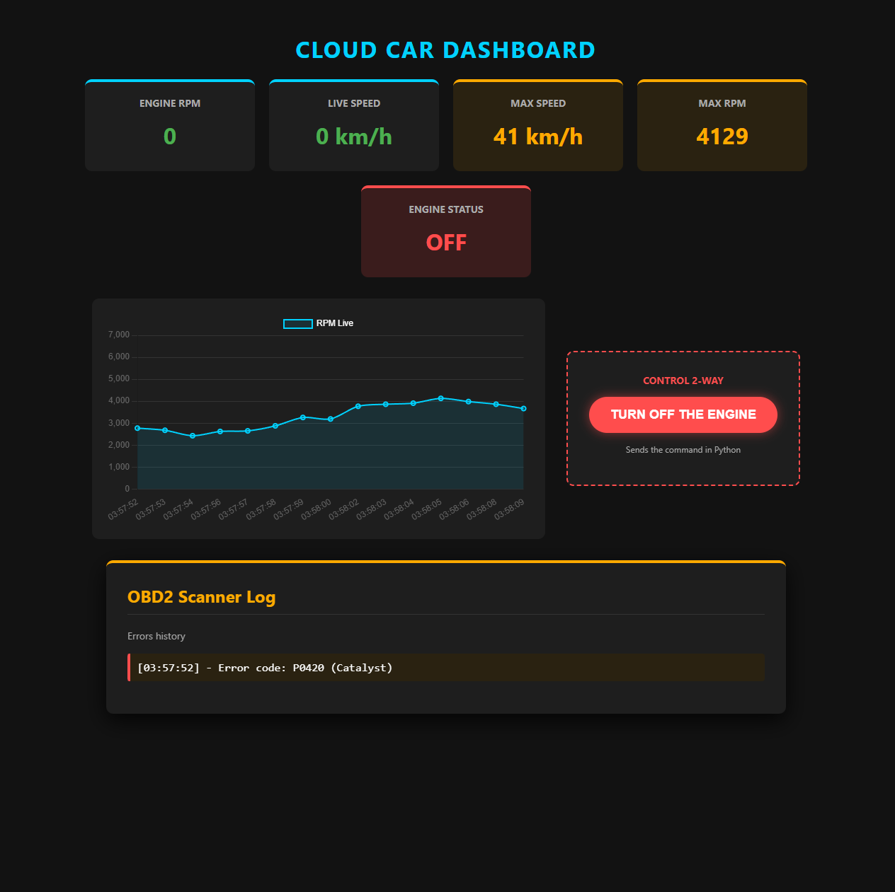

# 🏎️ Cloud & IoT Real-Time Fleet Dashboard

This project is an End-to-End simulation of an IoT (Internet of Things) system for real-time vehicle monitoring. The project simulates an OBD2 scanner that reads engine data, streams it to the cloud, and displays it on an interactive dashboard, while also allowing for remote control (2-Way Communication).

## ✨ Key Features

### 📈 Live Telemetry Dashboard
* **Real-Time Data Streaming:** Simulated engine data (RPM, Speed, Temperature) is pushed to the Cloud every second.
* **Interactive Interface:** A reactive web interface that updates values instantly without requiring page reloads.
* **Dynamic Charting:** Integrates **Chart.js** to visualize engine RPM fluctuations in real-time.

### 📋 Remote Control & Diagnostics
* **Two-Way Communication (Kill Switch):** The ability to send a command from the web interface (Frontend) directly to the Python script (Backend) to remotely shut down the engine.
* **On-Board Diagnostic System (OBD2 Log):** Built-in memory that logs error codes triggered during operation and generates a comprehensive diagnostic report when the engine stops.

## 🛠️ Technologies Used
* **Backend / Simulated Hardware:** Python 3 (libraries: `random`, `time`, `firebase-admin`)
* **Cloud Infrastructure:** Google Firebase (Realtime Database) for data synchronization.
* **Frontend:** HTML5, CSS3, JavaScript (Vanilla).
* **Data Visualization:** Chart.js

## ⚙️ System Architecture
1. **Python Script (`simulator.py`):** Generates realistic vehicle data and writes (Pushes) it to Firebase. Simultaneously, it listens (Pulls) for incoming stop commands.
2. **Google Firebase:** Acts as an ultra-fast Message Broker between the Python script and the web interface.
3. **Web Dashboard (`index.html`):** Listens for database changes via WebSockets and updates the DOM instantly.

## 🚀 How to Run Locally
1. Clone this repository: `git clone https://github.com/your-username/CarMonitorIoT.git`
2. Install the Firebase library for Python: `pip install firebase-admin`
3. Create a new project in [Google Firebase](https://console.firebase.google.com/) and configure a *Realtime Database*.
4. Download the private key `.json` file from your Firebase project settings and place it in the root folder.
5. Add your database URL in both `simulator.py` and `index.html`.
6. Run `simulator.py` and open `index.html` in any modern browser.